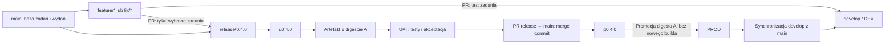
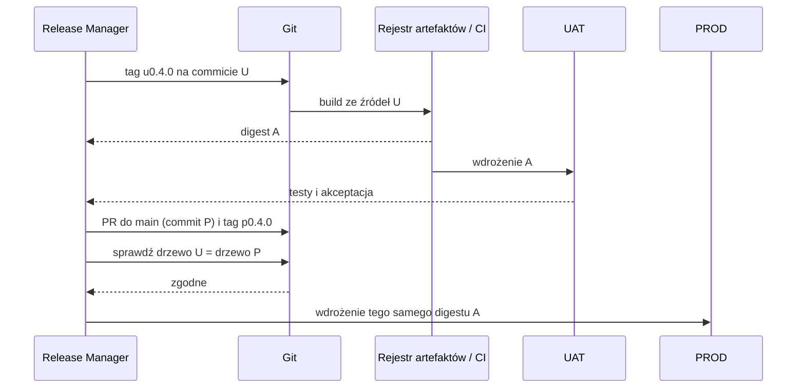
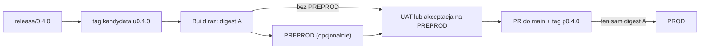

# Git flow: od zadania do wdrożenia

To repozytorium ilustruje proces **main-centric**: `main` jest bazą pracy i
wydań, a `develop` służy do integracji i testów DEV. Wydanie zawiera tylko
wybrane zadania, **nigdy całą zawartość `develop`**. Opis tagów i deploymentów
poniżej adaptuje bramki UAT/PROD z procesu New Vegas do historii tego repo.
Nie jest to klasyczny Git Flow, w którym release powstaje z `develop`.

> **Stan repo:** istnieją `main`, `develop` i przykładowe `release/*`, ale nie
> ma gałęzi `uat`, workflow CI/CD ani historycznych tagów wydań. Kroki
> oznaczone jako **docelowe** są procedurą do wdrożenia po skonfigurowaniu
> środowisk, uprawnień i pipeline'ów, a nie opisem działającej automatyzacji.
> Diagram i kroki 4-5 pokazują wariant z UAT bez gałęzi `uat`. Warianty z
> PREPROD i opcjonalną gałęzią `uat` opisano niżej.

## Mapa procesu



**Przykład:** `feature/EF-6` i `feature/EF-7` mogą być testowane na DEV
jednocześnie, ale do `release/0.4.0` trafia tylko `EF-6`. Po wydaniu `EF-7`
wraca na DEV ze swojej gałęzi.

| Gałąź / tag | Znaczenie |
| --- | --- |
| `main` | Wydany kod produkcyjny i baza nowych zadań oraz release. |
| `develop` | Integracja na DEV; może zawierać zadania niewydane. |
| `feature/*`, `fix/*` | Kod zadania tworzony z aktualnego `origin/main`. |
| `release/<wersja>` | Wybrane zadania na bazie `origin/main`; kandydat na środowisko pośrednie. |
| `u<wersja>` | Niezmienny anotowany tag kandydata do akceptacji UAT/PREPROD. |
| `p<wersja>` | Niezmienny anotowany tag commita produkcyjnego na `main`. |

W przykładach użyto wersji `0.4.0` (format `MAJOR.MINOR.PATCH`). Tag `u0.4.0`
oznacza źródło artefaktu testowanego na środowisku pośrednim, a `p0.4.0`
potwierdza promocję zaakceptowanego wydania do `main`. Nie twórz ich przed
odpowiednimi bramkami.

**SHA** identyfikuje commit, **drzewo plików** jego zawartość, a **digest
artefaktu** konkretny zbudowany pakiet lub obraz. Dwa różne commity mogą mieć
to samo drzewo plików, ale ponowne zbudowanie takiego kodu nie gwarantuje
identycznego artefaktu.

## Przed pierwszym wydaniem z tagami (docelowo)

Osoba odpowiedzialna za wydania (Release Manager) uzgadnia z DevOps:

1. Ochronę `main`, `release/*` i `develop`, wymagane review oraz kontrole CI.
   Zmiany do `main` i `release/*` mają przechodzić przez PR.
2. Sposób budowania **jednego niezmiennego artefaktu** z tagu `u<wersja>` i
   jego magazynowania wraz z digestem oraz SHA źródłowym (np. obraz z
   digestem w rejestrze). Deployment PROD ma wskazywać ten sam digest, a
   **nie przebudowywać** kodu po tagu `p<wersja>`.
3. Uwierzytelnienie i uprawnienia do tworzenia tagów oraz wdrożeń na wybrane
   środowiska, a także zatwierdzanie promocji po testach akceptacyjnych.
4. Zapis śladu wydania: wersja, PR, SHA `u` i `p`, digest artefaktu, wyniki
   CI i testów, akceptacja na wybranym środowisku, status deploymentów
   i osoba zatwierdzająca.
5. Zasadę zatrzymania wdrożenia, jeśli `main` zmienił się od utworzenia
   release lub kod zmergowanego `main` różni się od kandydata z UAT.

W tym repo nie ma jeszcze takiej automatyzacji. Samo wypchnięcie tagu **nie
wdraża niczego** bez skonfigurowanego pipeline'u (albo świadomie wykonanego
procesu ręcznego). Nie zakładaj, że `git push` oznacza udany deployment.

## 1. Utwórz gałąź zadaniową z main

Przykładowe nazwy: `feature/EF-6`, `fix/EF-7`. Zacznij od aktualnego stanu
serwera, nie od lokalnego `main` ani od `develop`:

```bash
git fetch origin --prune
git switch --create feature/EF-6 origin/main
# Wprowadź zmiany i sprawdź je lokalnie.
git add <zmienione-pliki>
git commit -m "feat(EF-6): add example"
git push --set-upstream origin feature/EF-6
```

Przed aktualizacją historii sprawdź `git status`; jeśli `git fetch` się nie
powiódł, zatrzymaj proces zamiast używać potencjalnie starego `origin/main`.

## 2. Przetestuj zadanie na DEV

1. Otwórz PR `feature/EF-6 -> develop` i przejdź review oraz wymagane CI.
2. Scal przez merge commit. Zweryfikuj wynik deploymentu DEV (jeśli
   skonfigurowany) i przetestuj funkcjonalność.
3. Poprawki nanieś na gałąź zadaniową i dostarcz kolejnym PR do `develop`.
4. Zachowaj gałąź zadaniową po scaleniu PR: z niej buduje się release.

Test na DEV nie oznacza, że zadanie weszło do wydania. `feature/EF-7` może
być już na `develop`, ale nie znaleźć się w `release/0.4.0`.
Do otwarcia PR na GitHubie wystarczy wypchnięta gałąź; nie trzeba przełączać
jej w drugim lokalnym katalogu ani worktree.

**Nie merguj `develop` do gałęzi zadaniowej**: w przeciwnym razie do wydania
mogą trafić cudze, niewydane zadania. Przed PR do release uaktualnij zadanie
wobec `main`:

```bash
git fetch origin
git switch feature/EF-6
git rebase origin/main
# Tylko gdy rebase przepisał historię już opublikowanej gałęzi:
git push --force-with-lease origin feature/EF-6
```

Rozwiąż konflikty i ponownie sprawdź zmianę. Rebase współdzielonej gałęzi
uzgodnij z jej współautorami; nie obchodź ochrony gałęzi.

## 3. Zbuduj paczkę release

Release Manager wybiera zadania przetestowane na DEV i tworzy release **z
aktualnego `origin/main`**:

```bash
git fetch origin --prune --tags
git switch --create release/0.4.0 origin/main
git push --set-upstream origin release/0.4.0
```

1. Otwórz osobny PR dla każdego zadania wybranego do wydania, np.
   `feature/EF-6 -> release/0.4.0`. Po review i CI scal go przez merge commit.
2. Sprawdź listę PR i różnicę `release/0.4.0` względem bazowego `main`.
   Potwierdź, że nie ma tam `EF-7` ani innych niewybranych zadań.
3. Wykonaj testy regresyjne całej paczki. Poprawki nanieś na gałąź zadania
   (i dostarcz na DEV) albo na release, a te ostatnie uwzględnij później na
   `develop`. Po zamrożeniu paczki nie dodawaj zadań bez ponownych testów.

**Nigdy nie otwieraj PR `develop -> release/*`.** W historii tego repo
`release/0.1` i `release/0.2` łączą wybrane gałęzie zadaniowe bezpośrednio.

## 4. Oznacz kandydata i wdroż go na UAT (docelowo)

Po zakończeniu kontroli paczki zamroź release. Sprawdź, że lokalna referencja
to najnowsza wersja z serwera oraz że tag o tej nazwie nie istnieje:

```bash
git fetch origin --prune --tags
git ls-remote --tags origin refs/tags/u0.4.0
git rev-parse origin/release/0.4.0
```

`git ls-remote` nie powinno zwrócić żadnego taga. Po potwierdzeniu SHA
kandydata i wyników kontroli utwórz **anotowany tag** na tym commicie:

```bash
git tag -a u0.4.0 origin/release/0.4.0 -m "UAT 0.4.0"
git push origin u0.4.0
git rev-parse 'u0.4.0^{commit}'
```

Pipeline UAT (po skonfigurowaniu) powinien zbudować artefakt z `u0.4.0`,
zapisać jego SHA źródłowy i digest, wdrożyć **ten digest** na UAT oraz zgłosić
wynik. W procesie ręcznym wykonaj te same kroki i zapisz te same dane.
Następnie sprawdź wdrożoną wersję, przeprowadź testy UAT i uzyskaj jawną
akceptację. Dopóki deployment lub testy UAT nie zakończą się powodzeniem,
**nie promuj wydania na PROD**.

Jeśli potrzeba zmienić kod po otagowaniu, nie przesuwaj ani nie usuwaj
`u0.4.0`. Przygotuj poprawionego kandydata pod nową wersją (np. `0.4.1`),
przetestuj go ponownie i dopiero potem utwórz nowy tag `u0.4.1`. Numer
produkcyjny odpowiada zaakceptowanemu kandydatowi.

## 5. Promuj zaakceptowane wydanie na main i PROD (docelowo)

1. Otwórz PR `release/0.4.0 -> main`. Potwierdź review, CI, akceptację UAT
   oraz brak nieplanowanych zmian w `main` od utworzenia kandydata.
2. Scal PR przez **merge commit** (jak historyczne wydania tego repo).
   Jeśli merge wprowadza konflikt lub dodatkową zmianę kodu, zatrzymaj
   promocję: nowy kod wymaga nowego kandydata i ponownych testów UAT.
3. Pobierz wynik i zweryfikuj, że tag UAT jest przodkiem `main`, a drzewa
   plików są identyczne. Obie poniższe komendy muszą zakończyć się kodem 0:

   ```bash
   git fetch origin --prune --tags
   git merge-base --is-ancestor u0.4.0 origin/main
   git diff --exit-code u0.4.0 origin/main
   ```

4. Sprawdź, że `p0.4.0` nie istnieje na serwerze. Oznacz zaakceptowany
   commit `main` anotowanym tagiem produkcyjnym:

   ```bash
   git ls-remote --tags origin refs/tags/p0.4.0
   git tag -a p0.4.0 origin/main -m "Production 0.4.0"
   git push origin p0.4.0
   git rev-parse 'p0.4.0^{commit}'
   ```

5. Pipeline PROD (po skonfigurowaniu) ma pobrać **digest artefaktu
   zaakceptowanego na UAT** i wdrożyć go bez przebudowy. Przed wdrożeniem
   zweryfikuj powiązanie wersji `0.4.0`, obu SHA oraz digestu; po wdrożeniu
   sprawdź status, wersję aplikacji, podstawowe scenariusze i zapisz wynik.

Merge commit na `main` powoduje, że tagi `u0.4.0` i `p0.4.0` **mają różne
SHA**, mimo identycznego drzewa plików. Warunkiem tej strategii jest
identyczny **digest wdrożonego artefaktu** na UAT i PROD. Wyzwolenie nowego
builda z `p0.4.0` nie spełnia tego warunku. Gdy kontrola drzew lub digestów
nie przechodzi, wstrzymaj deployment; nie naprawiaj sytuacji przez
przesunięcie tagu.



## Warianty środowiska pośredniego (docelowo)

Środowisko (DEV, PREPROD, UAT, PROD) to miejsce **uruchomienia artefaktu**,
niekoniecznie gałąź Gita. W tym repo `develop` może obsługiwać DEV, ale
PREPROD i UAT nie wymagają osobnych gałęzi. Wybierz przepływ zależnie od
tego, kto i co ma zatwierdzać:

| Wariant | Kolejność | Bramka przed PROD |
| --- | --- | --- |
| Tylko UAT (przykład w krokach 4-5) | DEV → UAT → PROD | Testy akceptacyjne UAT. |
| PREPROD przed UAT | DEV → PREPROD → UAT → PROD | Techniczne testy PREPROD, następnie akceptacja UAT. |
| PREPROD zamiast UAT | DEV → PREPROD → PROD | Akceptacja wydania na PREPROD przez wskazane osoby. |

### Zalecany wariant: deployment z taga, bez nowej gałęzi

1. Zbuduj **jeden** niezmienny artefakt z `u0.4.0` na `release/0.4.0` (krok 4);
   zapisz SHA źródła, digest i wersję. Tag nie oznacza jeszcze akceptacji.
2. Jeśli istnieje PREPROD, wdróż tam digest i wykonaj testy techniczne
   (integracja, konfiguracja, migracje, smoke testy). Potwierdź wynik.
3. Jeśli istnieje UAT, wdróż **ten sam digest** na UAT i uzyskaj akceptację
   biznesową. Jeśli UAT nie istnieje, PREPROD pełni rolę bramki akceptacji;
   zapisz, kto wydał zgodę.
4. Dopiero po wszystkich bramkach wykonaj PR `release/0.4.0 -> main`,
   sprawdź zgodność drzew z tagiem `u0.4.0`, utwórz `p0.4.0` i promuj
   **ten sam digest** na PROD (krok 5).

Tag `u<wersja>` w tym wariancie identyfikuje kandydata poddanego akceptacji.
Gdy jedynym środowiskiem pośrednim jest PREPROD, nazwa `u` jest umowna:
ustal ją jawnie z zespołem albo przyjmij inny prefiks i zmień razem
dokumentację oraz wyzwalacze pipeline'ów. Nie traktuj nazwy taga jako
dowodu, że deployment UAT faktycznie istnieje.



Wdrożenie tej opcji wymaga w pipeline'ie: wyzwalacza taga kandydata, magazynu
artefaktów z niezmiennym digestem, ręcznych lub automatycznych bramek między
środowiskami oraz joba PROD, który pobiera istniejący artefakt, zamiast
wykonywać nowy build. Każdy deployment zapisuje wersję i digest. Sekrety
i konfiguracja środowisk mogą się różnić, ale nie kod ani digest artefaktu.
Jeżeli konfiguracja jest wbudowywana w artefakt przy buildzie, najpierw
trzeba umożliwić konfigurację w czasie uruchomienia; inaczej nie można
uczciwie deklarować promocji tego samego artefaktu.

### Opcja zaawansowana: osobna gałąź `uat`

Dodaj `uat` tylko wtedy, gdy potrzebna jest stała gałąź do kontroli PR i
audytu kandydatów; samo dodatkowe środowisko nie jest wystarczającym
powodem. **`main` pozostaje bazą** feature'ów i release'ów, a `develop`
nie jest źródłem UAT ani release. Przed pierwszym wydaniem utwórz `uat`
ze stanu `main` (tylko uprawniona osoba), zabezpiecz PR/review i ustal
procedurę dla odrzuconych kandydatów:

```bash
git fetch origin --prune
git switch --create uat origin/main
git push --set-upstream origin uat
```

W tym wariancie **zastąp** fragmenty kroków 4-5:

1. Po testach release otwórz PR `release/0.4.0 -> uat` (merge commit).
   Upewnij się, że na `uat` nie ma żadnych wcześniejszych odrzuconych ani
   niezakwalifikowanych zmian.
2. Sprawdź, że drzewo plików `origin/uat` jest identyczne z
   `origin/release/0.4.0`. Oznacz **commit `origin/uat`**, nie commit release,
   tagiem `u0.4.0`. Wdróż jego artefakt na PREPROD/UAT i uzyskaj akceptację:

   ```bash
   git fetch origin --prune --tags
   git diff --exit-code origin/release/0.4.0 origin/uat
   git tag -a u0.4.0 origin/uat -m "UAT 0.4.0"
   git push origin u0.4.0
   ```

3. Po akceptacji otwórz PR **`uat -> main` zamiast `release/* -> main`**.
   Przed merge sprawdź, że `origin/uat` nadal wskazuje commit taga UAT i
   nie dostał kolejnych zmian:

   ```bash
   git fetch origin --prune --tags
   git rev-parse origin/uat
   git rev-parse 'u0.4.0^{commit}'
   ```

   Oba SHA muszą być identyczne. Po merge wykonaj kontrolę przodka i drzew
   z kroku 5, utwórz `p0.4.0` na `main` i wdróż **digest z UAT** na PROD.
4. Przed kolejnym release zweryfikuj, że `uat` zawiera tylko wydany kod.
   Jeśli UAT odrzuciło kandydata, **nie promuj `uat` do `main`**: tag zachowaj
   jako ślad, a nowego kandydata przygotuj pod nową wersją. Wycofanie
   odrzuconych zmian z trwałej gałęzi `uat` wymaga uzgodnionej procedury
   administratora (np. kontrolowanej synchronizacji z `main`) albo nowej,
   czystej gałęzi UAT. Nie wykonuj samowolnego resetu/force push.

Osobny merge commit na `uat`, a potem na `main`, daje **trzy różne SHA**:
release, tag UAT i tag PROD. Kontrole drzew oraz niezmienny digest pozostają
obowiązkowe. Nie próbuj jednocześnie scalać `release/* -> main` i
`uat -> main` dla tego samego wydania.

## 6. Zsynchronizuj develop i ponów testy niewydanych zadań

Po wydaniu `develop` może nadal zawierać `EF-7` i inne niewydane zadania.
Release Manager:

1. Sprawdza, czy ich kod (oraz ewentualne poprawki wykonane tylko na DEV)
   istnieje na zachowanych gałęziach zadaniowych. Zapisuje SHA bieżącego
   `origin/develop` oraz wydanego `origin/main`.
2. Koordynuje przerwę w PR/push do `develop`. Jeżeli polityka repo dopuszcza
   przepisywanie tej gałęzi, synchronizuje ją z wydanym `main`.
3. Ponownie kieruje niewydane gałęzie po rebase na `origin/main` do `develop`
   i wykonuje testy DEV. Nic nie trafia stamtąd automatycznie do release.

Przykład **tylko dla uprawnionej osoby w zwykłym klonie, bez lokalnych
zmian** (nie uruchamiaj go w worktree, gdzie `develop` jest zajęty):

```bash
git fetch origin
git switch develop
git reset --hard origin/main
git push --force-with-lease origin develop
```

`reset --hard` usuwa lokalne niezapisane zmiany, a push przepisuje historię
zdalnego `develop`. `--force-with-lease` nie zastępuje koordynacji; nie obchodź
ochrony gałęzi. Nigdy nie resetuj ani nie wypychaj z wymuszeniem `main`.

## Przypadki użycia dla programistów

### Dwa zadania na DEV, tylko jedno w release

`EF-6` i `EF-7` zaczynają od tego samego `origin/main`, przechodzą PR do
`develop` i są testowane na DEV. Do `release/0.4.0` tworzysz PR **tylko z
`feature/EF-6`**. Nie mergujesz `develop`, bo w ten sposób dołączyłoby
również `EF-7`. Po promocji release Release Manager synchronizuje `develop`,
a autor `EF-7` rebazuje swoją gałąź na aktualne `origin/main`, rozwiązuje
konflikty i ponawia PR oraz testy DEV.

### Poprawka odkryta podczas testów DEV

Przed wydaniem nanieś poprawkę na `feature/EF-6`, a nie wyłącznie na
`develop`. Przetestuj ją przez kolejny PR do DEV, następnie dodaj aktualną
gałąź zadaniową PR-em do release. Jeżeli poprawka jest już tylko na
`develop`, najpierw przenieś ją do gałęzi zadaniowej i sprawdź, czy PR do
release nie wnosi innych zmian. Nie kopiuj całego `develop`.

### Pilny błąd produkcyjny

Utwórz `fix/EF-8` z aktualnego `origin/main`. Jeśli to możliwe, przetestuj
poprawkę na DEV i przygotuj osobny release z `origin/main`, np. `release/0.4.1`.
Przejdź ponownie przez UAT (`u0.4.1`), PR do `main`, tag `p0.4.1` i
wdrożenie tego samego artefaktu. Nie dopisuj poprawki do istniejącego
`p0.4.0` i nie przestawiaj jego taga. Jeśli incydent wymaga pominięcia
którejś bramki, potrzebna jest jawna decyzja osoby odpowiedzialnej za
wydanie oraz osobna procedura awaryjna.

## Sytuacje brzegowe: rozpoznanie i reakcja

| Sytuacja | Co zrobić |
| --- | --- |
| Zadanie zostało scalone do `develop`, a PR do release pokazuje też cudzy kod. | Sprawdź bazę gałęzi i jej historię; usuń zależność od `develop` na gałęzi zadania, powtórz review. Nie merguj `develop` do release. |
| `git switch` zgłasza, że gałąź jest już używana przez inny worktree. | Pracuj w przypisanym worktree albo zakończ tę sesję i zwolnij worktree przed przełączeniem gałęzi w innym checkoutcie. Do samego PR przełączenie nie jest potrzebne. |
| Po rebase gałęzi zadaniowej PR do `develop` wygląda inaczej lub push jest odrzucony. | Rebase zmienia SHA; uzgodnij go ze współautorami, sprawdź zakres PR i użyj `--force-with-lease` tylko na własnej niechronionej gałęzi. Nie wymuszaj push na `develop`. |
| Kolejny commit trafił do `release/*` po utworzeniu `u0.4.0`. | Stary tag nadal oznacza poprzedni kandydat. Zatrzymaj promocję, nadaj nową wersję, ponów build, UAT i akceptację. |
| Wersja `u0.4.0` lub `p0.4.0` już istnieje. | Nie nadpisuj tagu. Ustal, czy release już trwał; w razie nowego kandydata nadaj nową wersję. |
| PR `release/* -> main` ma konflikty albo po merge drzewa plików są różne. | Nie twórz taga PROD i nie wdrażaj. Rozwiąż zmianę na release, nadaj nową wersję kandydata i ponów UAT. |
| `main` zmienił się podczas testów UAT. | Wstrzymaj PR i porównaj drzewa; jeśli wynik różni się od UAT, przygotuj nowego kandydata. Nie zakładaj, że przejście CI zastępuje akceptację UAT. |
| PREPROD działa, ale UAT nie istnieje. | Ustal, kto akceptuje wydanie na PREPROD; tag `u` jest wtedy tylko umowną nazwą kandydata albo zmień jego prefiks razem z pipeline'ami. Nie deklaruj testów UAT, których nie było. |
| Na gałęzi `uat` pozostał odrzucony kandydat. | Nie dodawaj kolejnego release na ten stan i nie otwieraj PR `uat -> main`. Najpierw przywróć czystą bazę w uzgodnionej procedurze lub użyj nowej gałęzi UAT. |
| Artefakt wymaga innego builda dla PREPROD i PROD. | Nie nazywaj go tym samym artefaktem; przenieś konfigurację do uruchomienia lub określ osobny proces weryfikacji artefaktów przed wprowadzeniem promocji. |
| UAT się udał, ale wdrożenie PROD chce zbudować obraz ponownie. | Zablokuj deploy i zmień procedurę na promocję digestu z UAT; zgodne drzewo plików nie gwarantuje identycznego obrazu. |
| `git push --force-with-lease` na `develop` jest odrzucony. | Ktoś zmienił gałąź lub działa jej ochrona. Nie używaj `--force`; ponownie sprawdź SHA, uzgodnij termin i uprawnienia. |
| PROD nie przeszedł kontroli po wdrożeniu. | Zachowaj ślad nieudanego wydania i tagi. Wdróż poprzednio zaakceptowany artefakt zgodnie z procedurą operacyjną; naprawę przygotuj w nowej wersji. |

## Lista kontrolna wydania

- [ ] Zakres `release/<wersja>` zawiera tylko zatwierdzone zadania, bez merge
      z `develop`; CI i regresja zakończyły się powodzeniem.
- [ ] Tag `u<wersja>` wskazuje zamrożony kandydat (release albo `uat`);
      artefakt ma zapisany digest i SHA; wybrane środowiska pośrednie
      przeszły testy i wymaganą akceptację.
- [ ] PR `release/* -> main` (lub `uat -> main`) przeszedł review i CI;
      tag kandydata jest przodkiem commita produkcyjnego, a drzewa plików
      obu commitów są identyczne.
- [ ] Tag `p<wersja>` wskazuje commit `main`; PROD wdrożył **ten sam digest**
      co UAT; wynik wdrożenia i kontrola powdrożeniowa są zapisane.
- [ ] `develop` został zsynchronizowany przez uprawnioną osobę; niewydane
      zadania wróciły na DEV ze swoich gałęzi.

Niepowodzenie bramki zatrzymuje dalszą promocję. Po nieudanym wdrożeniu
produkcji zachowaj tagi i ślad zdarzenia; odtwórz poprzednio zatwierdzony
artefakt zgodnie z procedurą operacyjną i przygotuj poprawkę jako **nowe
wydanie**. Nie przesuwaj tagów i nie ukrywaj nieudanego wydania.

### Przykład z historii repo

`release/0.1` połączyło `feature/EF-1` i `feature/EF-2`, `release/0.2`
połączyło `feature/EF-3` i `feature/EF-4`, a `release/0.3` zawierało
`feature/EF-5`. Wszystkie trzy wydania scalono do `main`. Można to obejrzeć:

```bash
git log --all --graph --oneline --decorate
```
